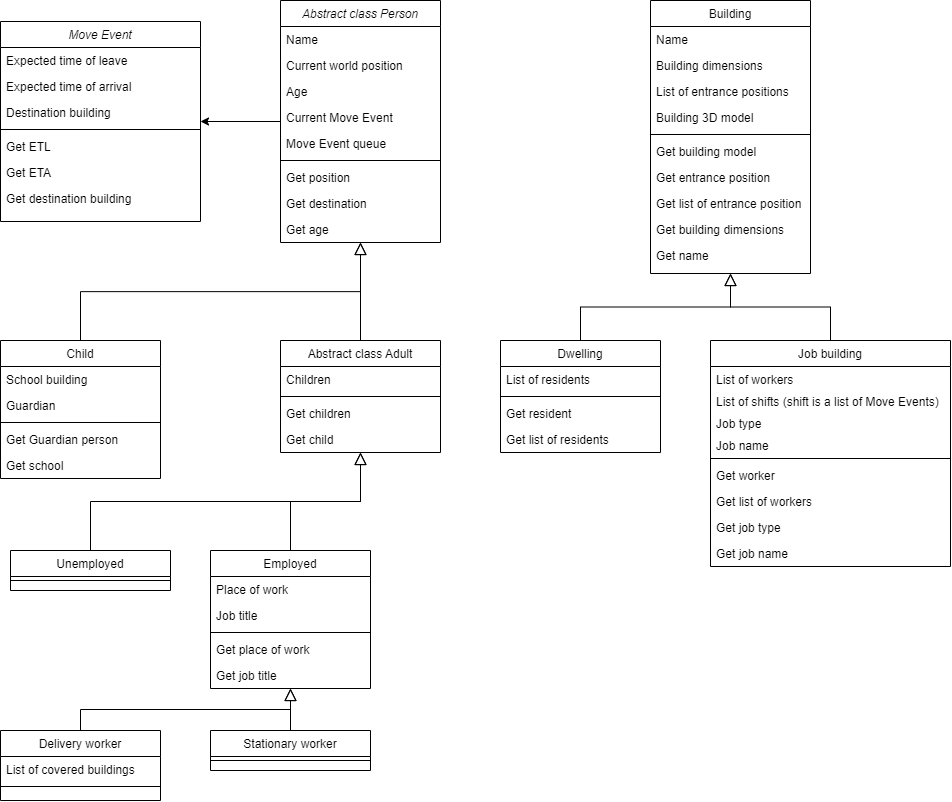

# Opis projektu

## Wprowadzenie

Projekt ten powstał w ramach przedmiotu "Programowanie Obiektowe" i nosi tytuł "Town simulator". Jako główne narzędzie pomocnicze użyłem silnika do gier Unity, choć nie zmienia to głównego celu tego projektu: projektowanie i implementowanie hierarchii klas zgodnie z powszechnie przyjętymi konwencjami i zasadami programowania obiektowego. Wedle nazwy, projekt ten symuluje proste miasteczko z ludźmi. Na czas pisania tego opisu przewidywane jest jedynie przygotowanie przykładowego miasteczka, ale, jeśli czas pozwoli, zaimplementuję też albo edytor takowego miasteczka, albo generator losowego.

Symulator taki przydaje się w chociażby symulacji rozprzestrzeniania się chorób w miastach, przepływu ruchu (gdybyśmy np. planowali zaimplementować również ruch drogowy). Główną zaletą mojego projektu będzie wizualizacja takiego miasta i ruchu poszczególnych osób do konkretnych miejsc.

## Hierarchia klas projektu

Aby skonstruować taką symulację będę potrzebował parę podstawowych klas. Obiekty jakie będą się znajdywać będą się dzieliły na dwie kategorie: ludzie i budynki (dla uproszczenia będziemy nazywać „ludzi” również „osobami” i obiektami, gdyż będą jedynie przedmiotami poruszającymi się po planszy) – a te, dalej będą się dzieliły na kolejne klasy. Oczywiście klasy „człowiek” i „budynek” będą klasami abstrakcyjnymi, gdyż nie mam w rzeczywistości odwzorowania tak podstawowych obiektów. Hierarchia klas tego projektu wygląda tak:

## Hierarchia klas budynków

Poniżej jest przedstawiony graf hierarchi klas budynków.

